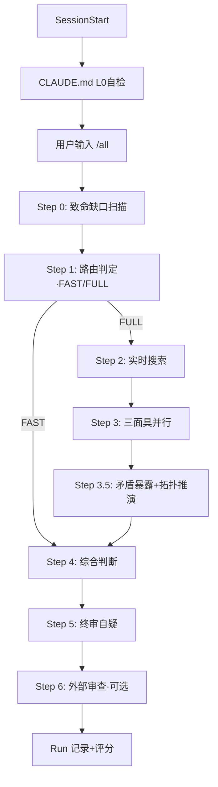

# TRIO 3.0 协议调用图

## 全局流程

## 协议触发条件

| 协议 | 触发条件 | 触发者 |
|------|---------|--------|
| context-isolation | /all Step 3 | all.md |
| self-verify | 每步完成后 | 自动 |
| topology-thinking | Step 5前 | all.md |
| audit-strictness | 评分时 | run-eval |
| external-review | 声明等级=理论时 | 手动/自动 |
| run-eval | 每次交付后 | Claude |
| talent/competitive-engine | P0信号密度预检通过 | 引擎自动激活规则 |
